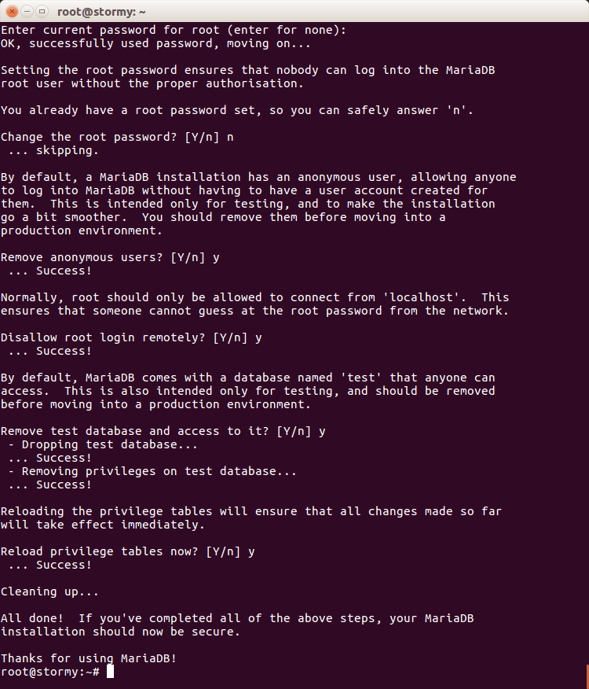
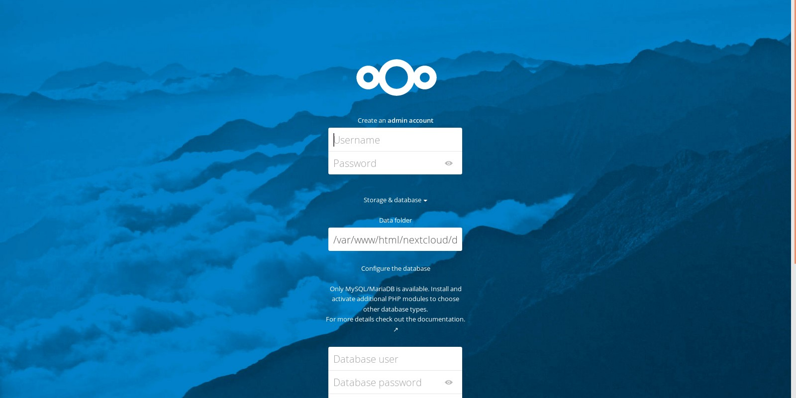

# Project_Infra_B2

## 1. Le sujet 

Ce projet se porte sur la construction d'une Infrastructure Nextcloud et du stockage de fichier à distance. 

## 2. Les Prérequis 

Dans un premier temps je vais vous citer ce dont nous avons besoin pour construire cette solution des plus pratiques 

- Une VM sous Debian 10/9 (avec environnement de développement GNOME).
- De PHP 7.3 (minimum). 
- De Apache2 pour la gestion des ports 80 et 443 (respectivement HTTP et HTTPS). 
- de MariaDB pour la base de données. 
- Nextcloud pour la gestion des fichiers. 

## 3. Mise en pratique

### 3.1 Installation de LAMP

Nextcloud fonctionne avec MariaDB/Mysql, Apache et PHP. Nous devons donc installer ces programmes sur notre système. 

Tout d'abord, mettons à jour le système :

    # apt-get update -y && apt-get upgrade -y 

Puis, procédons à l'installation d'Apache, de PHP et d'autres programmes requis pour installation de Nextcloud.

    # apt-get install apache2 libapache2-mod-php7.3 -y
    # apt-get install php7.3-gd php7.3-json php7.3-mysql php7.3-curl php7.3-mbstring -y 
    #  apt-get install php7.3-intl php7.3-mcrypt php-imagick php7.3-xml php7.3-zip zip -y

Enfin, installons MariaDB :

    # apt-get install mariadb-server php-mysql -y

### 3.2 Configuration de MariaDB

Par défault, l'installation de MariaDB n'est pas sécurisée. On peut la sécuriser grâce à la commande suivante :

    # mysql_secure_installation

L'image suivante vous montre comment répondre aux questions qui vous sont posées : 

Une fois le petit jeu des questions réponses, entrons dans la base données : 

    # mysql -u root -p

**NB** : Toutes les données en gras peuvent êtres modifiées selon notre bon vouloir. 

Création de la base de données Nextcloud : 

> MariaDB [(none)]> CREATE DATABASE **nextclouddb**;

Création d'un utilisateur avec son mot de passe pour Nextcloud : 

> MariaDB [(none)]> CREATE USER '**nextcloud**'@'**localhost**' IDENTIFIED BY '**Password**';

Affectation des privilèges à l'utilisateur créé : 

> MariaDB [(none)]> GRANT ALL PRIVILEGES ON **nextclouddb**.* TO '**nextcloud**'@'**localhost**';

> MariaDB [(none)]> FLUSH PRIVILEGES;

Enfin, quittez la base de données :

> MariaDB [(none)]> \q

### 3.3 Installation de Nextcloud 

Pour cette mise en place de la solution de stockage, nous installerons NextCloud dans le dossier root d'Apache. 
On peut bien sûr l'installer dans le répertoire de notre choix. 

    # cd /var/www/html/
    # wget https://download.nextcloud.com/server/releases/nextcloud-16.0.1.zip 
    # unzip nextcloud-16.0.1.zip
    # rm nextcloud-16.0.1.zip

Donnons à Apache les droits d'accéder à ce dossier : 

    # chown -R www-data:www-data /var/www/html/nextcloud

### 3.4 Création d'un hôte virtuel 

Passons à présent à la création d'un hôte virtuel sur le serveur. Pour ce faire, il nous faudra créer un fichier **nextcloud.conf** dans le dossier **/etc/apache2/sites-available**.

    # nano /etc/apache2/sites-available/nextcloud.conf 

Ajoutons ensuite les informations ci-dessous au nouveau fichier créé. Notez que vous pouvez remplacer les éléments en gras par vos propres informations. 

    # Alias /nextcloud "/var/www/html/nextcloud/"
    # <Directory /var/www/html/nextcloud/>
    #   Require all granted 
    #   AllowOverride All
    #   Options FollowSymlinks MultiViews
    
    #   <IfModule mod_dav.c>
    #     Dav off
    #   </IfModule>
    # </Directory>

A présent activons NextCloud :

    # a2ensite nextcloud

Désactivons le fichier hôte virtuel par défaut :

    # a2dissite 000-default 

Puis, activons les modules Apache :

    # a2enmod rewrite headers env dir mime setenvif.

Et enfin, redémarrons Apache : 

    # service apache2 restart 

Ouvrons notre navigateur, puis rendez-vous sur **http://localhost/nextcloud**

Si tout va bien normalement le navigateur devrais nous renvoyer une page de la sorte :

### 3.5 Installation d'un certificat ssl

Comme on peut le constater, le serveur fonctionne sur le HTTP qui est un protocole non-sécurisé. 
Pour rendre nos connexions sécurisées, il nous faudra installer un certificat ssl sur le serveur. 

Lors de son installation, Apache vient avec des certificats auto-signés. Nous utiliserons dans ce guide l'un d'eux. 

Nous pouvons installer l'un de ces certificats en lançant les commandes suivantes :

    # a2enmod ssl 
    # a2ensite default-ssl
    # service apache2 reload

Ou alors ajouter le repo & installer letsencrypt

    # echo "deb http://deb.debian.org/debian stretch-backports main" >> /etc/apt/sources.list

    # apt-get update && apt-get install certbot python-certbot-apache -t stretch-backports

Obtenir le certificat :

    # certbot --apache -w /var/www/html/nextcloud -d domaine.fr
    

